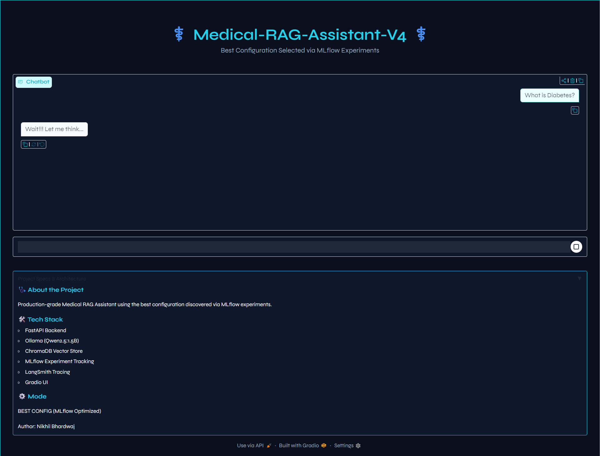
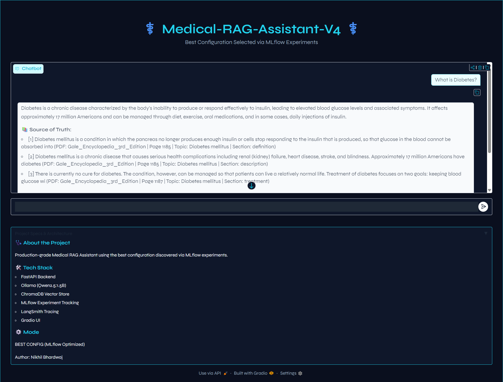
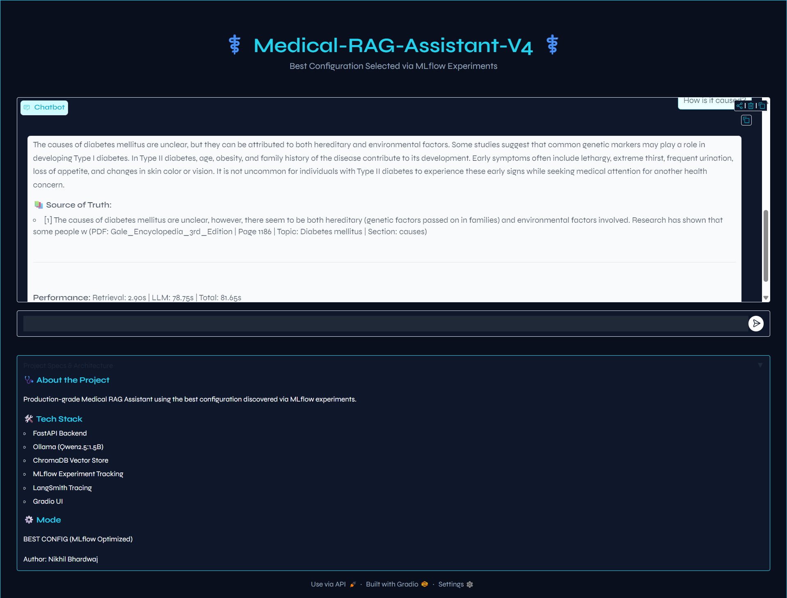

# ⚕️ Medical-RAG-Assistant-V4

A **production-grade Retrieval-Augmented Generation (RAG) system** designed for **clinically grounded medical question answering**.

The system retrieves information **directly from medical textbook PDFs** and generates answers **strictly grounded in sources**, eliminating hallucinations and ensuring **traceable citations**.


<p align="center">
  
</p>

<p align="center">
  
</p>

<p align="center">
  
</p>

---

## 🚀 Features

- ✔ Hybrid Retrieval (**Dense + Sparse + Reranking**)
- ✔ PDF-based medical knowledge base
- ✔ **Query rewriting + intent detection** for follow-up questions
- ✔ **Conversation memory with topic tracking**
- ✔ **Streaming responses** for real-time answers
- ✔ **LangSmith tracing** for observability
- ✔ **MLflow experiment tracking** for configuration optimization
- ✔ **Gradio UI** for interactive chat
- ✔ **Dockerized deployment**

---

## 🧠 System Architecture

```
User
│
▼
Gradio UI
│
▼
FastAPI Backend
│
├── Query Rewriter
├── Intent Detection
├── Hybrid Retriever
│   ├── Dense Retrieval (Sentence Transformers)
│   ├── Sparse Retrieval (BM25)
│   └── Reranker (Cross Encoder)
│
├── Prompt Builder
├── LLM (Ollama)
│
└── Citation Generator
```

All answers are generated **only from retrieved documents**.

---

## 📚 Knowledge Base

The system uses a **medical textbook corpus** containing:

- Gale Encyclopedia of Medicine
- Disease definitions
- Symptoms, Causes, Treatments, Prevention

Each answer includes **exact citations with page references**.

**Example:**

```
📚 Sources

[1] Gale Encyclopedia of Medicine
Page 1931 — Hypertension — Definition
```

---

## 🔎 Example Query

**User**
```
What causes diabetes?
```

**Response**
```
The causes of diabetes mellitus are believed to involve both hereditary and environmental factors.
Research indicates that individuals who develop diabetes may have common genetic markers.
In Type I diabetes, the immune system may be triggered by a virus or microorganism that destroys
insulin-producing cells in the pancreas. In Type II diabetes, factors such as age, obesity, and
family history play a role.

Sources:
[1] Gale Encyclopedia of Medicine — Page 1186
```

---

## 📊 Experiment Tracking

The project uses **MLflow** to identify the best-performing RAG configuration.

Experiments optimize:

- Dense vs sparse retrieval weights
- Reranker boost values
- Top-k retrieval parameters
- Temperature and generation settings

> The best configuration is automatically loaded at runtime.

---

## 🔍 Observability with LangSmith

LangSmith tracing provides full visibility into the RAG pipeline.

**Trace example:**

```
rag_stream_pipeline
│
├── query_rewrite
├── retrieval
├── prompt_building
└── llm_generation
```

This allows debugging:
- Retrieval failures
- Prompt issues
- Hallucination sources

---

## 🖥️ User Interface

The assistant includes a custom **Gradio UI** with:

- Dark medical theme
- Streaming answers
- Source citations
- Performance metrics

**Example:**
```
Performance:
Retrieval: 0.41s | LLM: 6.12s | Total: 6.53s
```

---

## ⚡ Performance

| Stage      | Time     |
|------------|----------|
| Retrieval  | ~0.4s    |
| LLM        | ~5–7s    |
| Total      | ~6s      |

---

## 🐳 Docker Deployment

The entire system is containerized.

**Build**
```bash
docker-compose build
```

**Run**
```bash
docker-compose up
```

**Access**

| Service | URL |
|---------|-----|
| API | http://localhost:8001 |
| UI  | http://localhost:7860 |

---

## 🛠️ Tech Stack

| Component           | Technology           |
|---------------------|----------------------|
| Backend             | FastAPI              |
| UI                  | Gradio               |
| Vector Store        | ChromaDB             |
| Embeddings          | Sentence Transformers|
| Sparse Search       | BM25                 |
| Reranking           | Cross Encoder        |
| LLM                 | Ollama               |
| Observability       | LangSmith            |
| Experiment Tracking | MLflow               |
| Deployment          | Docker               |

---

## 📁 Project Structure

```
Medical-Rag-Assistant-V4/
│
├── .env                              # DAGSHUB_USERNAME, DAGSHUB_TOKEN, OLLAMA_HOST
├── .env.example
├── .gitignore
├── .dockerignore                     # Phase 9
├── pyproject.toml                    # uv dependencies
├── .python-version
├── README.md
├── main.py
├── dvc.yaml                          # Full pipeline definition
├── requirements-docker.txt           # Phase 9
├── Dockerfile                        # Phase 9
├── docker-compose.yml                # Phase 9
│
├── configs/
│   ├── ingestion.yaml                # Phase 1
│   ├── cleaning.yaml                 # Phase 2
│   ├── embeddings.yaml               # Phase 3
│   ├── vectorstore.yaml              # Phase 4
│   ├── retrieval.yaml                # Phase 5
│   ├── rag.yaml                      # Phase 6
│   ├── experiment.yaml               # Phase 7
│   └── best_config.yaml              # Auto-generated by extract_best_config
│
├── data/                             # DVC tracked
│   ├── raw/                          # Source PDF
│   ├── processed/                    # Cleaned chunks
│   ├── embeddings/                   # Generated vectors
│   └── golden/                       # Evaluation dataset
│
├── src/
│   ├── __init__.py
│   │
│   ├── utils/                        # Phase 0
│   │   ├── __init__.py
│   │   ├── logging.py
│   │   └── config.py                 # Updated every phase
│   │
│   ├── ingestion/                    # Phase 1
│   │   └── ingest.py
│   │
│   ├── cleaning/                     # Phase 2
│   │   └── clean.py
│   │
│   ├── embeddings/                   # Phase 3-4
│   │   ├── embed.py
│   │   └── vectorstore.py
│   │
│   ├── retrieval/                    # Phase 5
│   │   ├── schema.py
│   │   ├── dense.py
│   │   ├── sparse.py
│   │   ├── hybrid.py
│   │   ├── reranker.py
│   │   └── retriever.py
│   │
│   ├── rag/                          # Phase 6
│   │   ├── schema.py
│   │   ├── memory.py
│   │   ├── guardrails.py
│   │   ├── explainability.py
│   │   ├── chain.py
│   │   ├── rag_service.py
│   │   └── run_with_best_config.py   # Phase 7
│   │
│   ├── api/                          # Phase 7
│   │   ├── app.py                    # FastAPI (base)
│   │   └── app_best.py               # FastAPI (best config)
│   │
│   ├── frontend/                     # Phase 7
│   │   ├── gradio_app.py
│   │   └── gradio_app_best.py
│   │
│   └── experiments/                  # Phase 7
│       ├── metrics.py
│       ├── evaluator.py
│       ├── experiment_runner.py
│       ├── extract_best_config.py
│       ├── compare_base_vs_best.py
│       ├── tag_best_run.py
│       ├── rank_experiments.py
│       ├── save_base_metrics.py
│       ├── metric_improvement_report.py
│       └── find_global_best_run.py
│
├── tests/
│   ├── unit/
│   │   ├── test_ingestion.py         # Phase 1
│   │   ├── test_cleaning.py          # Phase 2
│   │   ├── embeddings.py             # Phase 3
│   │   ├── vectorstore.py            # Phase 4
│   │   ├── test_dense.py             # Phase 5
│   │   ├── test_sparse.py            # Phase 5
│   │   ├── test_hybrid.py            # Phase 5
│   │   ├── test_reranker.py          # Phase 5
│   │   ├── test_retriever.py         # Phase 5
│   │   ├── test_memory.py            # Phase 6
│   │   ├── test_guardrails.py        # Phase 6
│   │   ├── test_chain.py             # Phase 6
│   │   ├── test_rag_service.py       # Phase 6
│   │   └── test_streaming.py         # Phase 7
│   │
│   └── integration/
│       ├── test_ingest_clean.py      # Phase 2
│       ├── inge_clean_embed.py       # Phase 3
│       ├── ing_cle_emb_vector.py     # Phase 4
│       ├── test_retrieval_pipeline.py # Phase 5
│       └── test_rag_pipeline.py      # Phase 6
│
└── .github/
    └── workflows/
        └── ci.yaml                   # Phase 1
```

---

## 🧪 Testing

Unit and integration tests are included.

**Run tests:**
```bash
pytest
```

---

## 🔐 Guardrails

The system includes safeguards:

- No hallucinated medical advice
- Answers strictly grounded in documents
- Clear fallback when sources lack information

---

## 📌 Roadmap

Future improvements:

- [ ] Small LLM Model - Qwen2.5:1.5B via Ollama, which is lightweight and fast but has limitations in reasoning and medical depth. Less detailed explanations. Upgrade to Qwen2.5:7B, Mistral 7B, Llama 3
- [ ] Local Vector Database - The project uses ChromaDB in local persistent mode. Not suitable for distributed production deployments. Migrate to Pinecone, Weaviate, Qdrant.
- [ ] Single PDF Knowledge Source - Currently the system retrieves information from one medical encyclopedia PDF so Limited knowledge coverage. Add multi-document ingestion pipeline
- [ ] Model Startup Latency - On container startup, embedding and reranking models are loaded dynamically. Startup time ~20–40 seconds
- [ ] Limited Evaluation Dataset - MLflow experiments currently evaluate using a small golden dataset. Expand the evaluation dataset
- [ ] Medical NER for better retrieval
- [ ] GPU acceleration for reranking
- [ ] The current UI uses Gradio, which is simple but limited. Not ideal for production-level interfaces. Rebuild with React Or migrate to Next.js

---

## 👨‍💻 Author

**Nikhil Bhardwaj**

---

## ⭐ Support

If you find this project useful, consider giving the repository a **star ⭐**